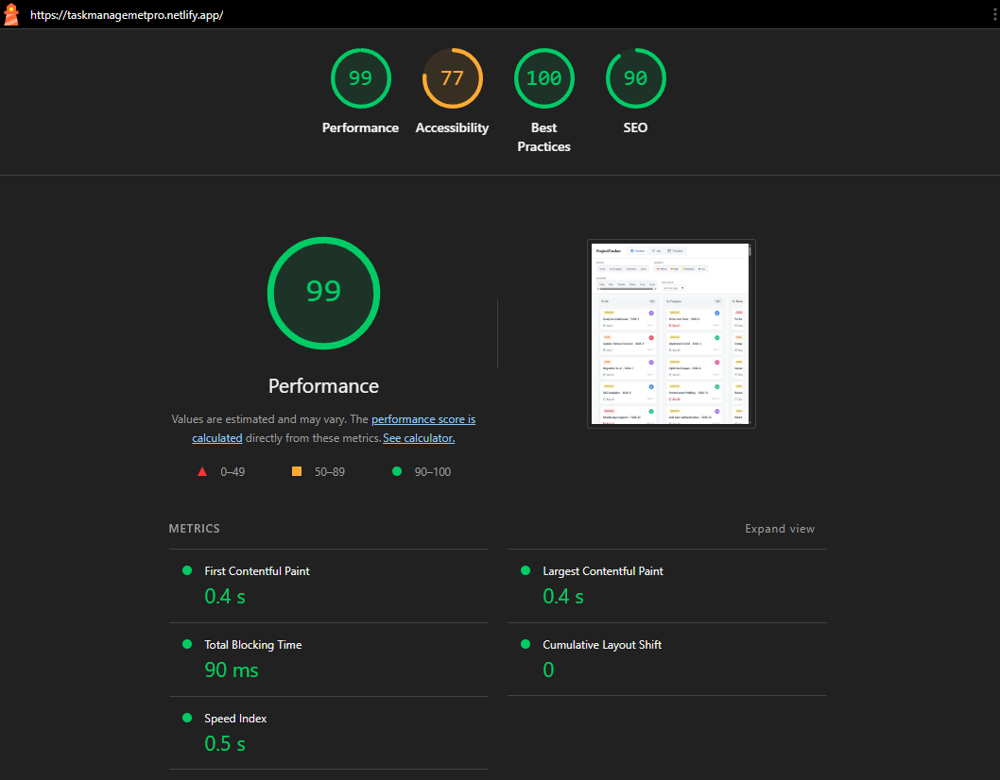

# 🚀 Multi-View Project Tracker

A high-performance frontend project management application built using **React (TypeScript)** and **Tailwind CSS**, featuring a fully custom **drag-and-drop system**, **virtual scrolling**, and **simulated real-time collaboration** — all implemented without external libraries.

---

## 📦 Setup Instructions

### Prerequisites

* Node.js (v16 or above recommended)
* npm or yarn

### Installation

```bash
npm install
```

### Run Development Server

```bash
npm run dev
```

Open your browser and navigate to:

```
http://localhost:5173
```

### Build for Production

```bash
npm run build
```

---

## 🧠 State Management Decision (Why Zustand?)

The application uses **Zustand** for global state management.

Zustand was chosen over React Context because:

* It avoids unnecessary re-renders by allowing selective subscriptions.
* It provides a simpler and more scalable API for managing shared state.
* It efficiently handles frequently updated states such as drag interactions and filters.
* It keeps the codebase clean and modular compared to Context + useReducer.

The global store manages:

* `tasks`: Shared dataset across all views
* `filters`: Active filter state synced with URL
* `activeView`: Current UI view (Kanban, List, Timeline)
* `draggedTaskId` and UI interaction states
* `presenceUsers`: Simulated collaboration users

---

## 🖱️ Custom Drag-and-Drop Implementation

The drag-and-drop system is implemented **from scratch** using native pointer events.

### Approach

1. **Drag Start**

   * `onPointerDown` sets the active `draggedTaskId` in the global store.

2. **Drag Movement**

   * A floating drag preview (`DragOverlay`) follows the cursor using real-time pointer coordinates.
   * The dragged card is visually styled with reduced opacity and shadow.

3. **Placeholder Handling (No Layout Shift)**

   * Instead of removing the original element, it is rendered with reduced opacity.
   * This preserves layout space and prevents column shifting.

4. **Drop Target Detection**

   * Uses `document.elementsFromPoint(x, y)` to detect valid drop zones.
   * Targets are identified using custom `data-column-status` attributes.

5. **Drop Behavior**

   * Valid drop → updates task status
   * Invalid drop → card smoothly snaps back to original position

6. **Cross-Device Support**

   * Works seamlessly for both mouse and touch interactions

---

## ⚡ Virtual Scrolling Implementation

To efficiently handle large datasets (500+ tasks), a custom virtual scrolling system is implemented in the List View.

### Approach

1. **Problem**

   * Rendering all rows causes performance issues and slow scrolling.

2. **Solution**

   * Only render rows visible in the viewport + buffer (overscan).

3. **Implementation Details**

   * Calculate visible range using scroll position
   * Maintain total height using a spacer container (`totalItems × rowHeight`)
   * Render only a sliced portion of the dataset (`startIndex → endIndex`)
   * Use `translateY(offset)` to correctly position rows

4. **Optimizations**

   * Scroll events handled using `requestAnimationFrame`
   * No flickering, blank gaps, or jump during fast scroll

---

## 👥 Live Collaboration Simulation

A simulated real-time collaboration system is implemented without a backend.

### Features

* 2–4 mock users with unique colors
* Users are randomly assigned to tasks using intervals
* Avatar indicators appear on task cards
* Smooth animation when users move between tasks
* Top bar displays active users count
* Multiple users on same task → stacked avatars with overflow indicator

---

## 🔍 Filters & URL State

The application supports dynamic filtering with URL synchronization.

### Filters

* Status (multi-select)
* Priority (multi-select)
* Assignee (multi-select)
* Due date range

### Features

* Filters apply instantly (no submit button)
* Filter state is stored in URL query parameters
* Page reload restores filter state
* Browser back/forward navigation restores previous filters
* "Clear Filters" button appears only when filters are active

---

## ⚠️ Edge Case Handling

* Empty Kanban columns show styled empty states
* No results after filtering → meaningful empty state with CTA
* Tasks due today → labeled as "Due Today"
* Tasks overdue by more than 7 days → show "X days overdue"

---

## 🎨 UI & Styling

* Built entirely with **Tailwind CSS**
* No UI component libraries used
* Custom-built components:

  * Buttons
  * Dropdowns
  * Task cards
  * Badges
* Responsive for desktop and tablet devices

---

## 🚀 Performance (Lighthouse)

The application achieves a **Lighthouse performance score of 85+** on desktop.




---

## 🧩 Explanation (150–250 words)

The most challenging part of this project was implementing a fully custom drag-and-drop system without relying on external libraries while maintaining a stable and smooth user experience. A key difficulty was preventing layout shifts when dragging items between Kanban columns. Instead of dynamically removing and inserting DOM elements, which causes reflow and visual instability, I retained the original card in place using a reduced opacity style. This preserved the layout structure and acted as a natural placeholder.

Another major challenge was accurately detecting valid drop targets. Rather than implementing complex collision detection algorithms, I leveraged the native `document.elementsFromPoint()` API to identify elements under the cursor using custom data attributes. This approach simplified the logic while remaining highly reliable.

For performance optimization, I implemented a custom virtual scrolling system that renders only the visible portion of the dataset along with a small buffer. This significantly reduced DOM size and ensured smooth scrolling even with over 500 tasks.

Given more time, I would refactor the drag-and-drop logic into reusable hooks and abstract common behaviors to improve maintainability and scalability, especially for extending similar interactions to other views like the timeline.

---

## 🌐 Deployment

The application can be deployed easily using:

* Vercel
* Netlify

No environment variables are required.

---

## 📁 Repository

Include:

* Source code
* README
* Lighthouse screenshot
* Live deployed link

---
